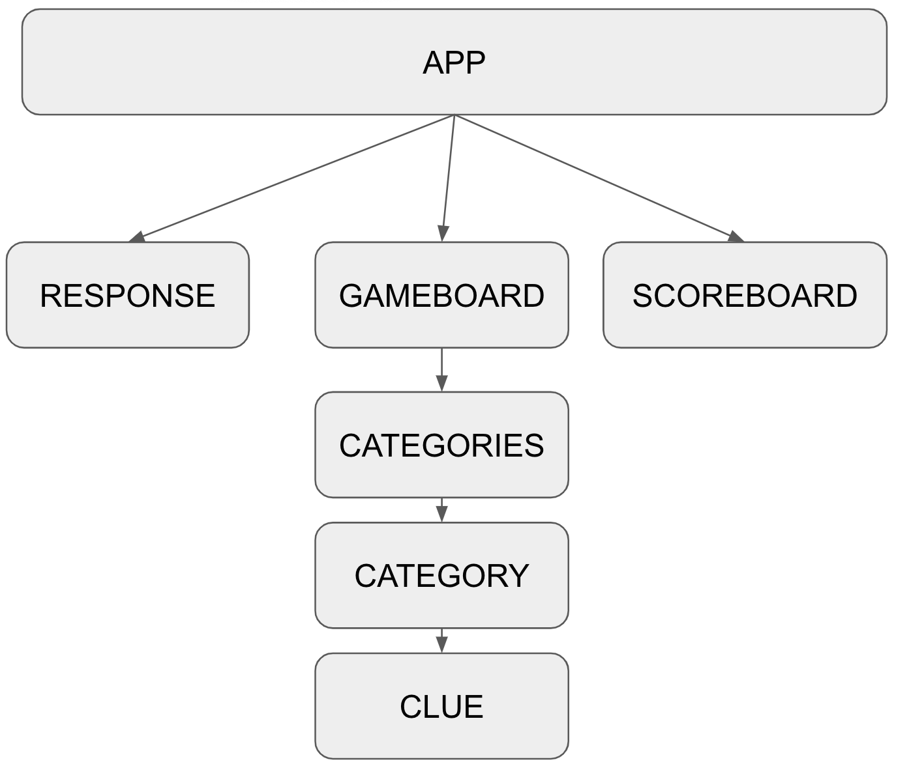
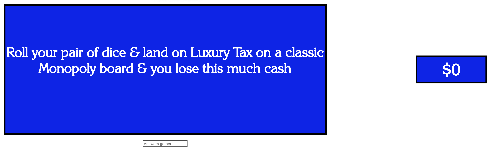
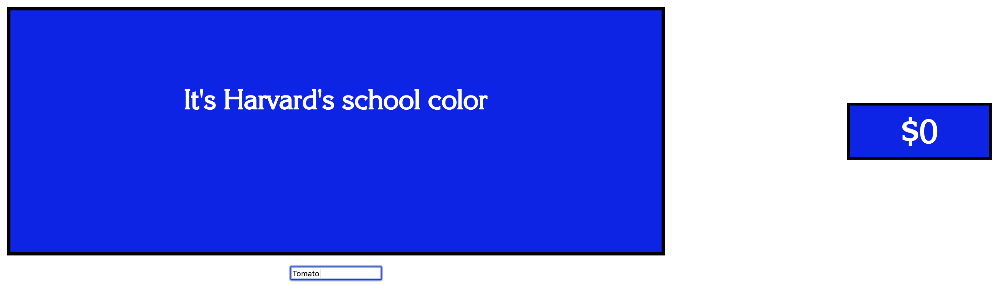
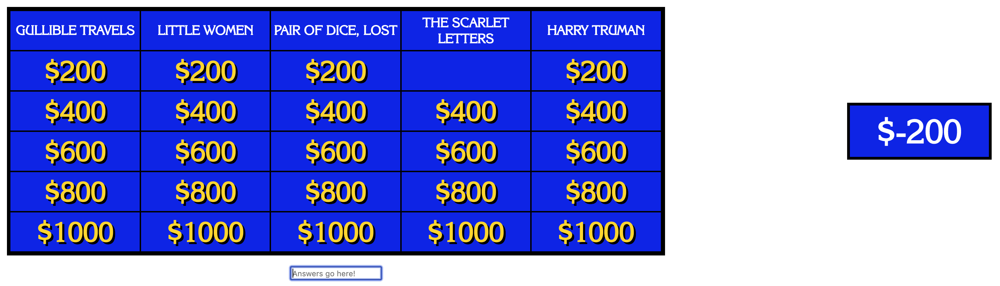

# This section of the Three Mile Island nuclear power facility melted down in 1979.

## Objectives

 - Understand how to implement conditional rendering
 - Apply nested components
 - Perform external API requests
 - Use react life-cycle method: ComponentDidMount

## Getting started

In this sprint, you'll be completing an application that may or may not ressemble a popular game show!

 - *Initial setup:* `npm install`
 
 - *Run the app:* In a new terminal tab, start the application with `npm start`

 - *Run the test suite:* `npm test`
 
 - Make sure you `add` and `commit` frequently!

**Minimum Requirements:**

 - Make all tests pass

 - Make sure you complete all of the user stories (not everything is covered by the test suite!)

 - Look at the style.css and assign the appropriate classes/id's to the components
 
**Advanced Content:**

 - Refactor your asyncronous code to use [promises](https://developer.mozilla.org/en-US/docs/Web/JavaScript/Reference/Global_Objects/Promise)
 
 - Implement buzz-in local multiplayer with multiple scoreboards.
 
 - Add CSS animations to handle the transitions between conditional renderings
 
 - Devise a way for a user to request all the clues from a particular day
 
 - Then, add the ability to request clues from categories
 
 - Create a replay feature to capture the most exciting moments of your multiplayer games.
 
 - Use [redux](https://redux.js.org/) to manage application state.

## Application Overview

Below is a flow chart that illustrates how the components in this application are connected.

Please note how some components are nested in other components. Your data should also flow in the direction of the arrows,from parent to child.

## User stories

**As a player, when I start the game, I should be able to see the GAMEBOARD, SCOREBOARD, and RESPONSE so that I can play the game**

Acceptance criteria:
 
- [ ] Displays GAMEBOARD (use testdata.js)
  - [ ] Includes CATEGORIES (with correct info), each displays CATEGORY
  - [ ] CATEGORY by default should list CLUES with their $ value
- [ ] Displays SCOREBOARD
  - [ ] Should default to $0
- [ ] RESPONSE
  - [ ] Should only accept a response when a CLUE is selected

---------------------------------------------------

**As a player, I want to click on a CLUE (e.g. $200) so that I can view the question(CLUE) and try to answer it**

Acceptance criteria:
 
- [ ] Replaces GAMEBOARD with CLUE question when ($)CLUE is clicked
  - [ ] Displays RESPONSE
  - [ ] Displays SCOREBOARD
  - [ ] RESPONSE
    - [ ] Should show a response input
    - [ ] Should switch back to full GAMEBOARD when reponse is submitted
  - [ ] GAMEBOARD
    - [ ] After submitting a response: does not show CLUE dollar value when displaying CATEGORIES

---------------------------------------------------

**As a player, I want to get scored on the answer that I submit, so that I know how I am doing**

Acceptance criteria:
 
- [ ] RESPONSE
  - [ ] Should submit response when user hits the enter key
  - [ ] Should switch back to GAMEBOARD when reponse is submitted
  - [ ] GAMEBOARD does not show CLUE dollar value when displaying CATEGORIES
  - [ ] Displays SCOREBOARD
    - [ ] Updates score after response based on correct / incorrect answer

Entering a reponse:

After submitting a reponse:

---------------------------------------------------

**As a player, I want my CLUES to be sourced from an external API, so that I always have the newest questions**

Acceptance criteria:
 
- [ ] GAMEBOARD
  - [ ] Displays CATEGORIES and CLUES from (http://jservice.io/)
  - [ ] Gets CATEGORY ids, and CLUES for each category id

---------------------------------------------------
